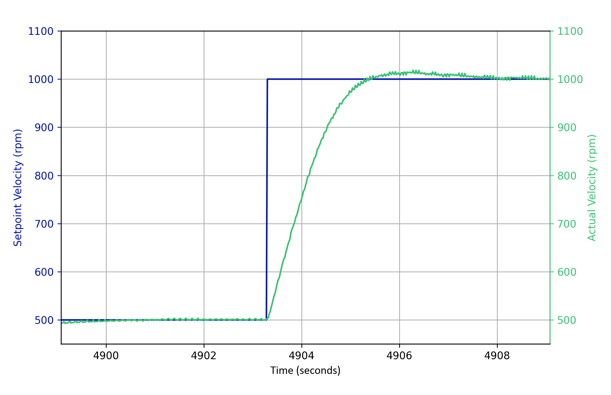
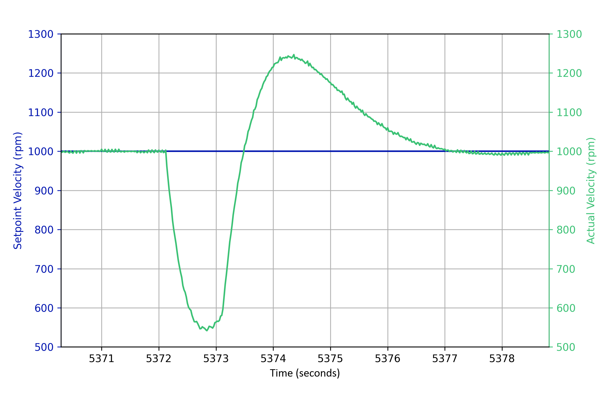

# Time Discrete PID Controller In C
## Overview
The PID controller is a time discrete controller which can run on any hardware that runs C/C++ code (e.g. STM32 hardware).

## Key Features
The controller has the following features that can be activated or deactivated as desired:
- Anti-reset-windup
- First-order low-pass filter for error signal
- PI controller if ```Td = 0```
- PD controller if ```Ti = 0``` (disables integration term)
- P controller if ```Ti = 0``` and ```Td = 0```

## Results
The controller can be used to control various different systems, such as the angular velocity of a motor.
What follows are transient responses of a motor being controlled by a PI controller using the code from this project.
Both step responses were performed using PI parameters calculated using the Reinisch approach for tuning for a sample rate of 50ms.

<table border="0">
  <tr>
    <td valign="top" width="50%">
      <h3>Reference step response (&Delta;&omega; = 500 rpm)</h3>
      
    </td>
    <td valign="top" width="50%">
      <h3>Disturbance step response (magnitude unknown)</h3>
      
    </td>
  </tr>
</table>

## Getting Started
To get started using the code, please copy both the ```pid.h``` as well as the ```pid.c``` file into your working directory.
Next, you can include ```pid.h``` within the file you would like to use the pid controller by including ```#include "pid.h"``` at the top of the document.

### Important Notice
The PID controller must be executed at a fixed sampling interval `Ts` for correct behavior.
This is typically enforced using a hardware timer interrupt in embedded systems (e.g. STM32).

The sampling time `Ts` is configured during initialization.

### Instantiation And Initialization
Firstly, an instance of the PIDControllerInfo must be created and initialized.
```C
PIDControllerInfo pid_info;
pid_init(&pid_info);
pid_para_set(&pid_info,
             2.0f,    // Kp
             0.8f,    // Ti
             0.05f,   // Td
             0.02f,   // Tf
             0.01f);  // Ts = 10 ms loop
pid_limits_set(&pid_info, 0.0f, 100.0f); // if limits exist, define the limits here
pid_arw_set(&pid_info, true); // if arw is used (if not, you may replace true with false)
```

### PID Control Loop
The controller needs to run a compute step each loop cycle. This can be done using the ```pid_execute()``` function.
```C
// within loop:
float actuation_value = 0.0f; // Initialization as fallback
float current_control_error = compute_control_error(); // This is where you compute the current error signal of your specific system
pid_execute(&pid_info, current_control_error, &actuation_value); // Computes an actuation value and updates the controller state

// use actuation_value for PWM / DAC / motor control
```